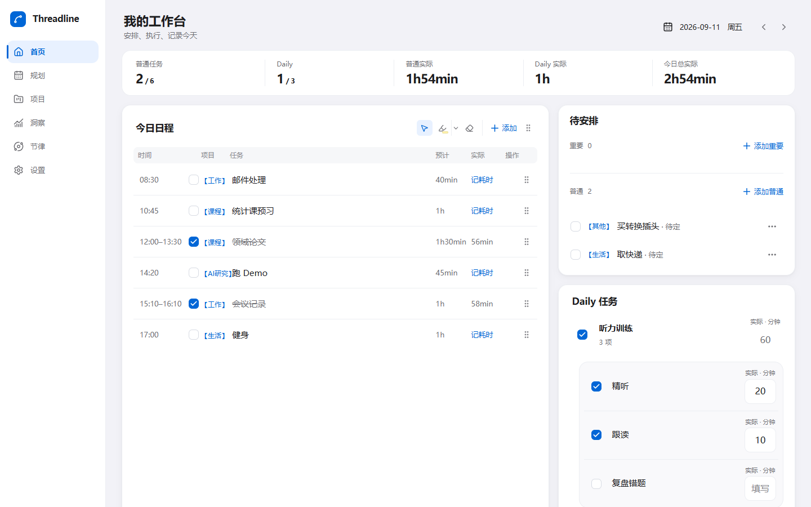
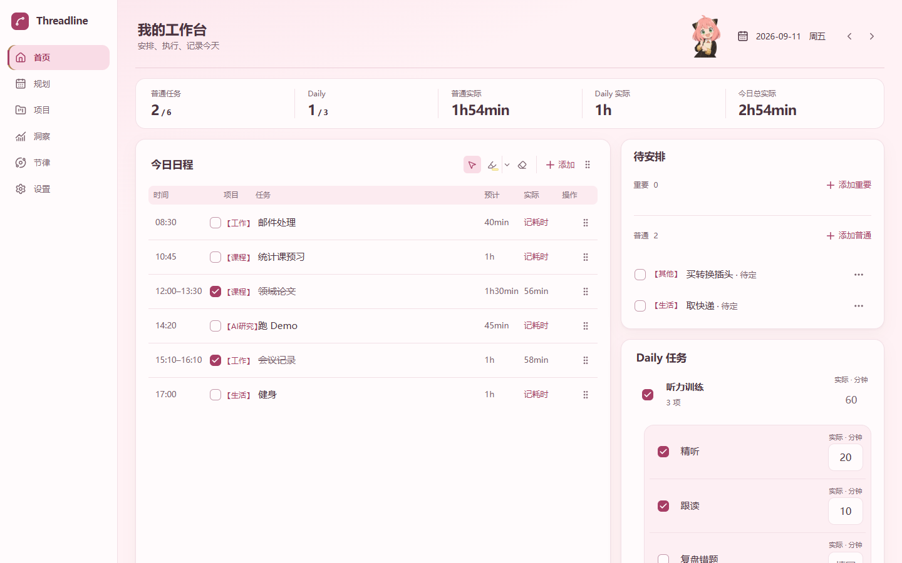
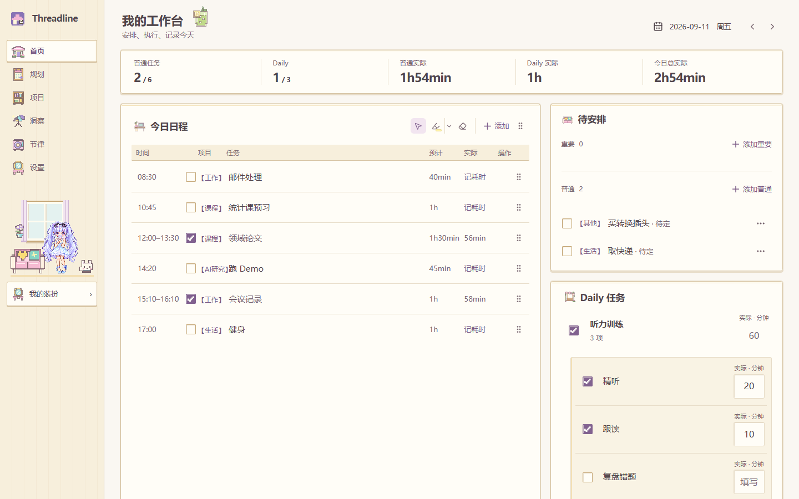
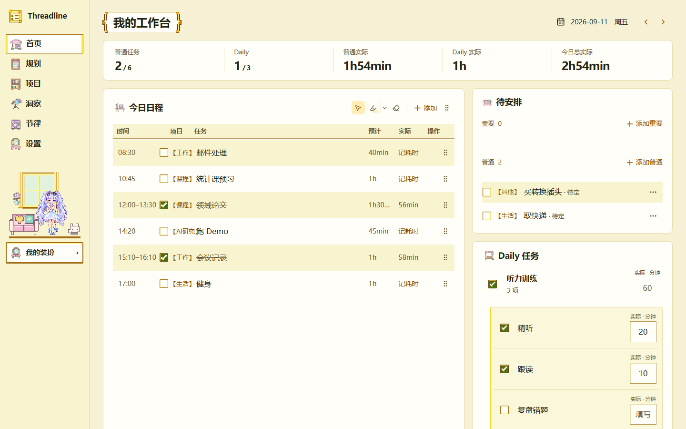
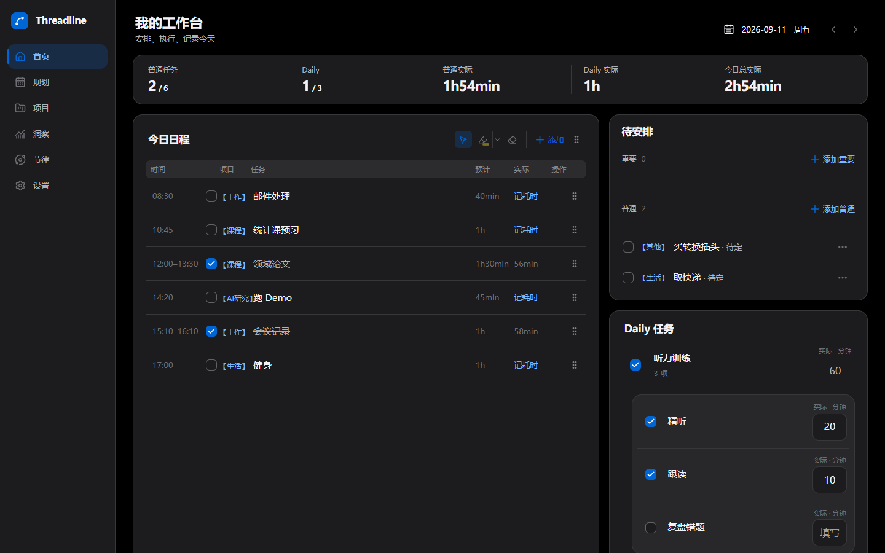
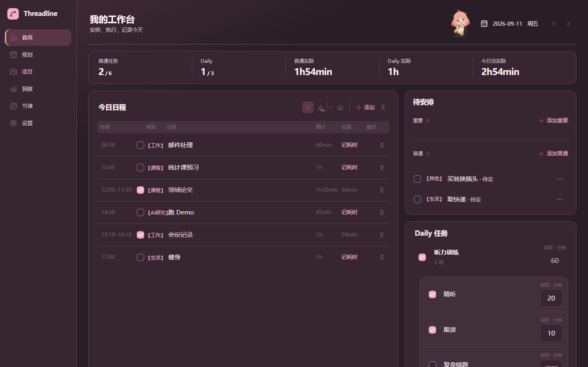
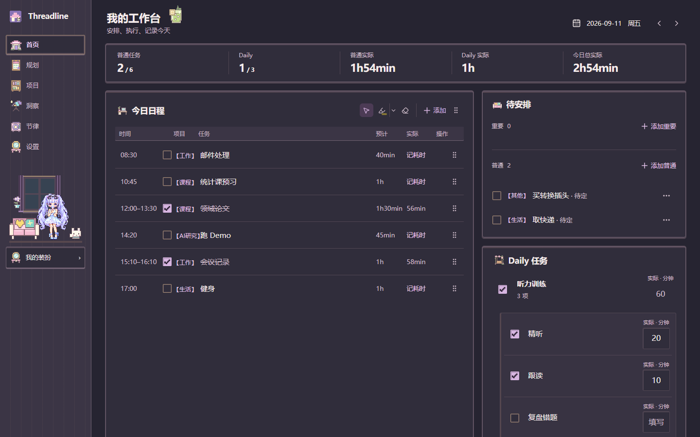
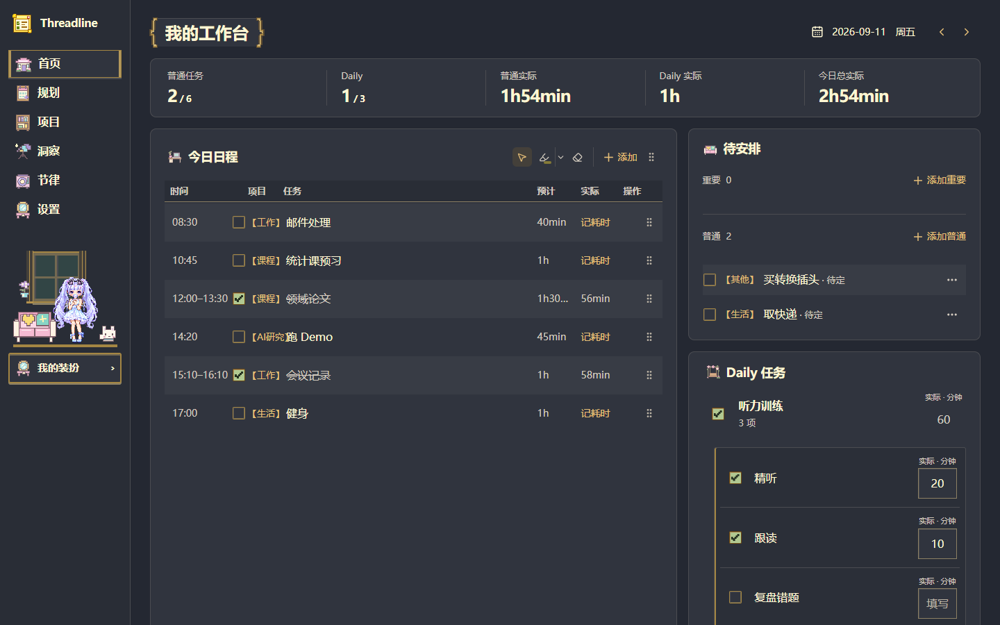

<!-- 文件用途：展示 Threadline 的产品体验、下载入口与开发文档导航。 -->

<p align="center">
  
</p>

<h1 align="center">Threadline</h1>

<p align="center"><strong>安排今天，也留住认真生活的痕迹。</strong></p>
<p align="center">一个把任务、日常习惯与时间规划放在一起的个人工作台。</p>

<p align="center">
  <a href="https://github.com/Doris619619/Threadline/releases/latest">下载 Windows 版</a> ·
  <a href="#开始使用">开始使用</a> ·
  <a href="#本地开发">本地开发</a> ·
  <a href="#文档导航">文档导航</a>
</p>

<p align="center"><sub>桌面浏览器 · iPhone PWA · Windows</sub></p>



<p align="center"><sub>默认蓝色 · 截图使用虚构演示数据</sub></p>

## 从今天开始

| 想做的事           | Threadline 如何帮你                                                                   |
| :----------------- | :------------------------------------------------------------------------------------ |
| **专注今天**       | 在同一页安排日程、勾选任务、记录实际投入，结束时完成每日收尾。                        |
| **先记下，再安排** | 重要与普通待安排分组保存，想好时间后再放进日程。                                      |
| **坚持日常**       | 用 Daily 管理重复的日常清单，在首页记录当天完成情况。                                 |
| **记录作息**       | 在习惯中一键记录起床、睡觉和工作效率，查看周/月趋势、补录历史，并独立调整目标与分档。 |
| **看见时间**       | 从月历进入单日时间轴，查看安排与空闲，调整任务日期。                                  |
| **回顾投入**       | 在洞察中查看实际耗时与项目分布，导出复盘报告。                                        |
| **轻装工作**       | Windows 工作站以置顶小窗呈现任务，可收起到屏幕边缘。                                  |

## 让工作台更像你

四套主题，三种字体。主题、字体与明暗模式可以自由组合，选择会保存在当前设备。

<table>
<tr>
  <td width="25%" align="center"><a href="docs/screenshots/readme/blue-light.png"></a><br /><sub>默认蓝色 · 浅色</sub></td>
  <td width="25%" align="center"><a href="docs/screenshots/readme/anya-light.png"></a><br /><sub>安妮雅 · 浅色</sub></td>
  <td width="25%" align="center"><a href="docs/screenshots/readme/cottage-light.png"></a><br /><sub>皮卡小屋 · 浅色</sub></td>
  <td width="25%" align="center"><a href="docs/screenshots/readme/classic-light.png"></a><br /><sub>皮卡经典 · 浅色</sub></td>
</tr>
<tr>
  <td width="25%" align="center"><a href="docs/screenshots/readme/blue-dark.png"></a><br /><sub>默认蓝色 · 深色</sub></td>
  <td width="25%" align="center"><a href="docs/screenshots/readme/anya-dark.png"></a><br /><sub>安妮雅 · 深色</sub></td>
  <td width="25%" align="center"><a href="docs/screenshots/readme/cottage-dark.png"></a><br /><sub>皮卡小屋 · 深色</sub></td>
  <td width="25%" align="center"><a href="docs/screenshots/readme/classic-dark.png"></a><br /><sub>皮卡经典 · 深色</sub></td>
</tr>
</table>

八种外观一览，点击小图可查看原图。

在 **设置 → 外观** 中切换主题和字体；皮卡主题还可以从 **我的装扮** 选择穿搭，和白猫互动。

## 开始使用

**Windows** — 前往 [最新版本](https://github.com/Doris619619/Threadline/releases/latest)，下载以 `x64-setup.exe` 结尾的安装包。安装版启动后自动检查更新，回到主窗口或电脑休眠恢复时也会在距离上次检查至少一小时后补查。发现新版时，标题栏显示小型 **更新** 入口，点击才展开下载详情；下载完成后入口显示 **重启更新**，由你确认重启。也可在 **设置 → 关于 Threadline** 中手动检查。

**浏览器与 iPhone** — 打开你部署的 Threadline 网站；iPhone 可通过 Safari 的“添加到主屏幕”作为 PWA 使用。部署方式见 [云端与 Web 部署](docs/supabase-deployment.md)。

登录后，任务、项目、Daily 与习惯通过 Supabase 在设备间同步。习惯支持账号时区，睡觉和效率以凌晨 04:00 分日；手机底栏可直接进入。主题、字体和批注等设备偏好保留在本机。习惯需要先部署新增迁移，详见 [习惯规则与上线说明](docs/habits.md)。

> 正在使用 0.1.1 或未安装的预览目录？请手动安装最新版本一次。详见 [Windows 自动更新](docs/desktop-auto-update.md)。

## 本地开发

需要 **Node.js ≥ 22.12.0**、**pnpm 11.19.0**，以及一个 Supabase 项目。

```powershell
pnpm install
Copy-Item .env.example .env.local
# 在 .env.local 填写 Supabase 公开配置
pnpm dev
```

打开 <http://localhost:3000>。首次配置请按 [开发与运行指南](docs/development.md) 完成环境变量和数据库迁移；未配置云端时会显示配置提示。

前端采用 **Next.js App Router · React · TypeScript**，Windows 端由 **Electron** 复用同一套界面与业务逻辑。

## 文档导航

| 想了解什么               | 从这里开始                                                                                                          |
| :----------------------- | :------------------------------------------------------------------------------------------------------------------ |
| 本地启动、命令与目录结构 | [开发与运行指南](docs/development.md)                                                                               |
| 任务、Daily 与交互规则   | [产品与交互参考](docs/interaction-reference.md) · [交互反馈](docs/interaction-feedback.md)                          |
| 主题与字体               | [外观说明](docs/appearance.md) · [皮卡小屋](docs/pixel-cottage.md) · [皮卡经典](docs/pika-classic.md)               |
| Windows 构建与发布       | [本地打包](docs/WINDOWS_BUILD.md) · [自动更新](docs/desktop-auto-update.md)                                         |
| 云端部署与数据           | [Supabase / Vercel](docs/supabase-deployment.md) · [数据完整性](docs/data-integrity.md)                             |
| 测试与贡献               | [测试架构](docs/testing-architecture.md) · [工程协作规范](docs/工程协作规范.md) · [PR 撰写规范](docs/PR撰写规范.md) |

---

[版本记录](https://github.com/Doris619619/Threadline/releases) · [反馈问题](https://github.com/Doris619619/Threadline/issues)
