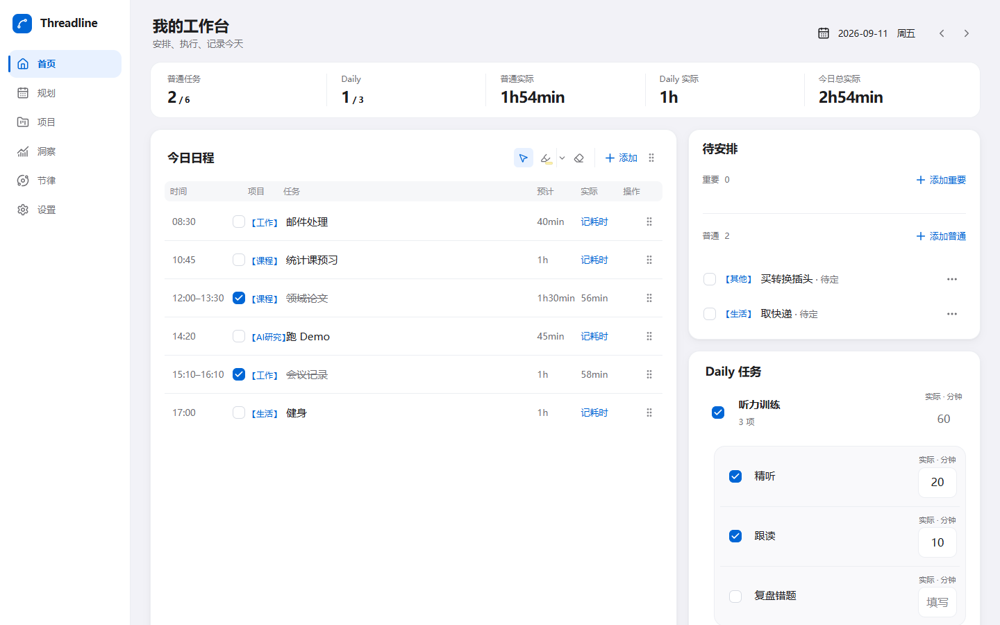
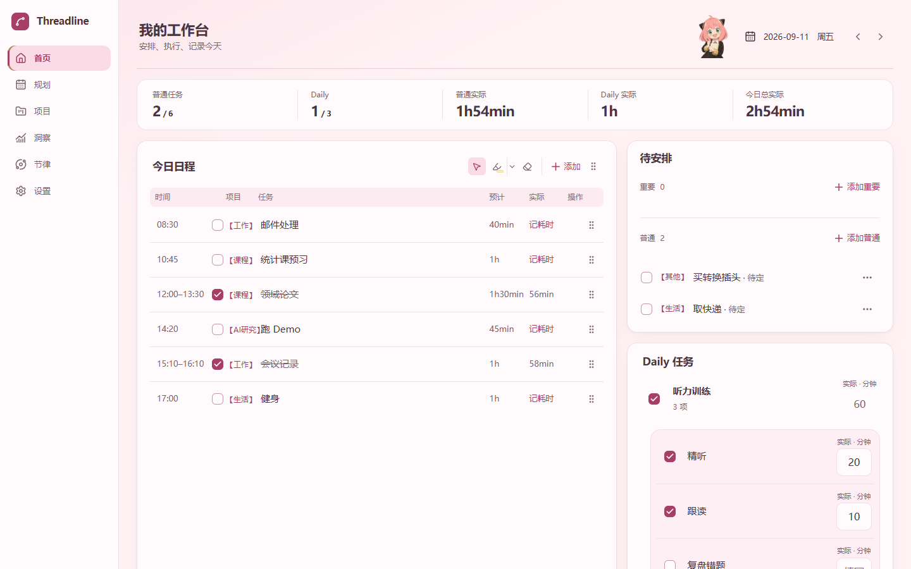
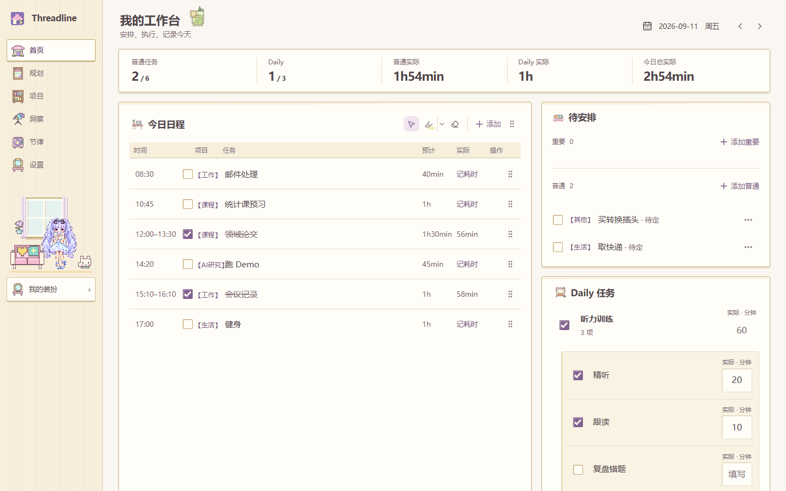
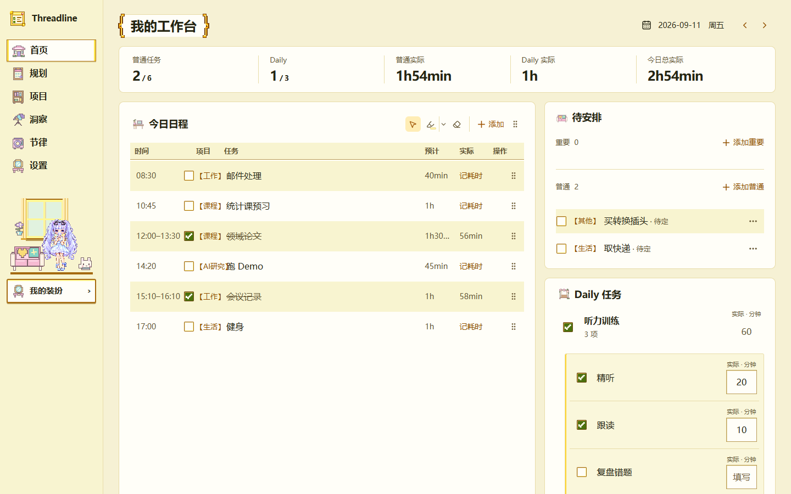
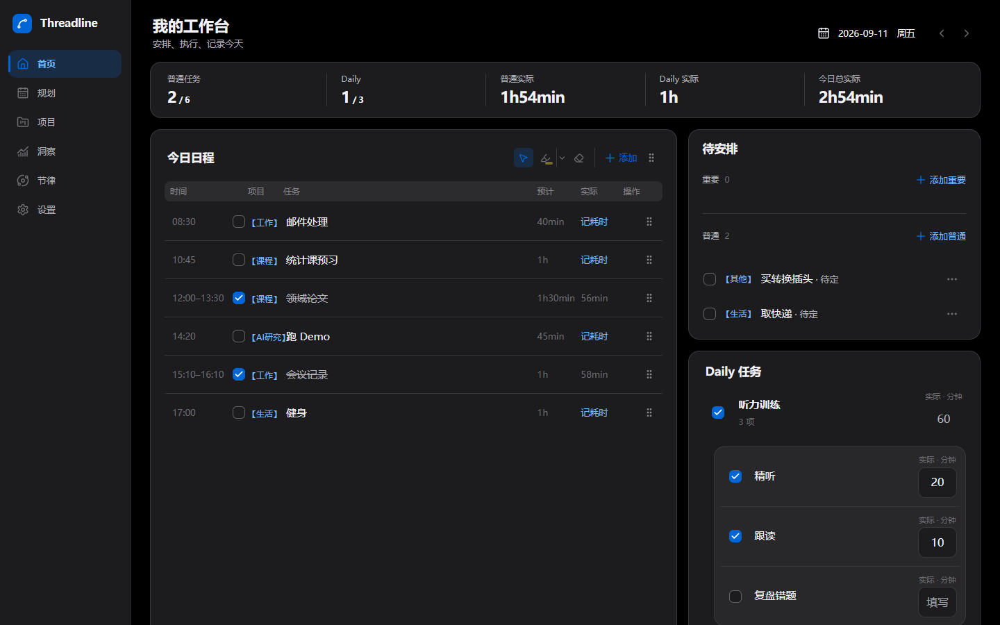
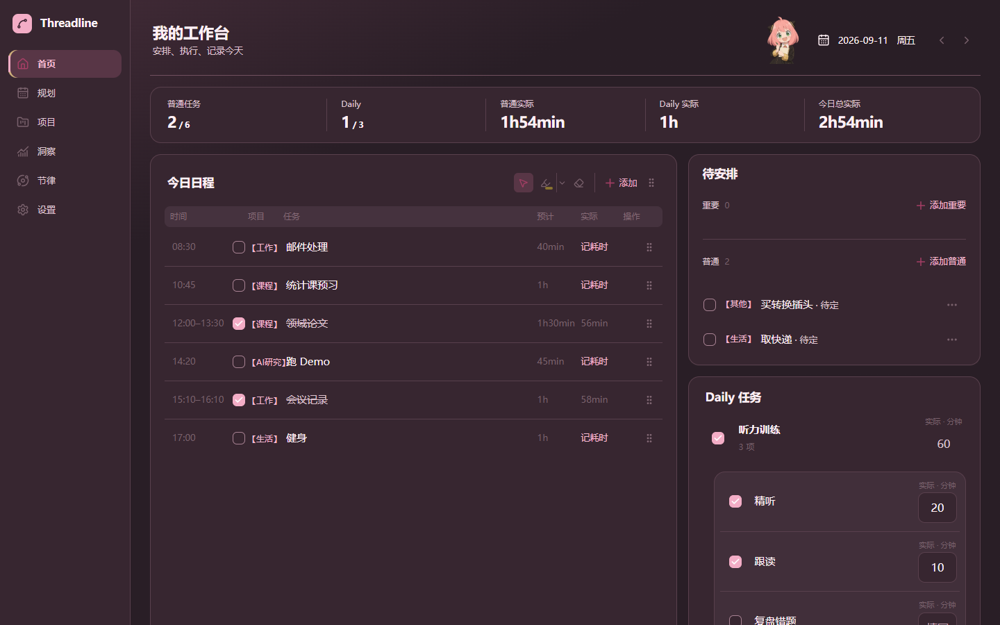
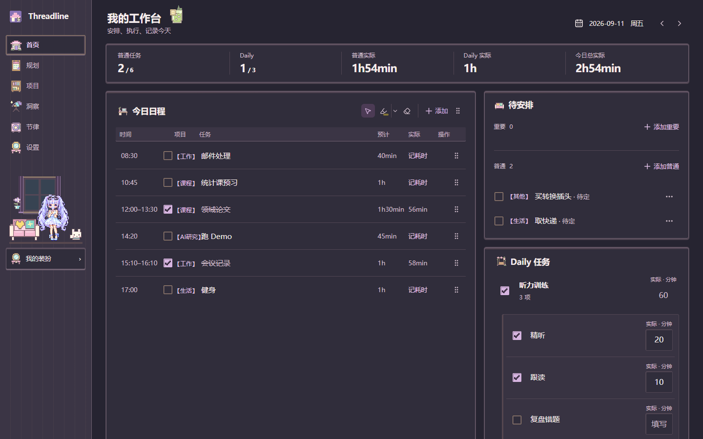
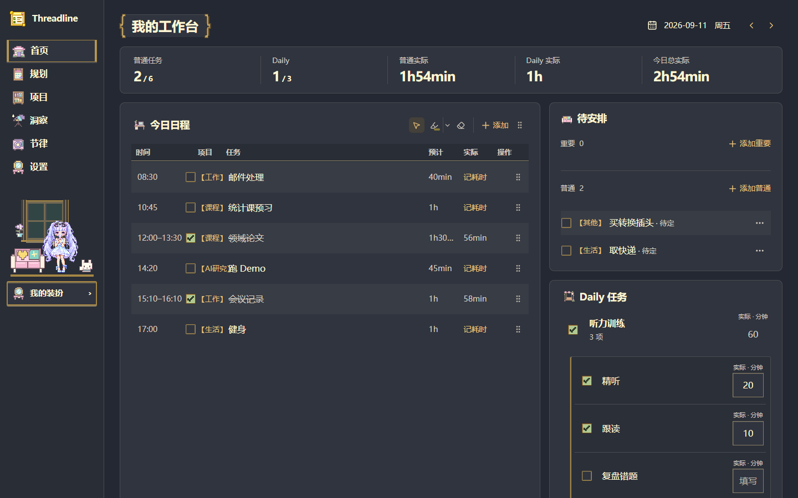

<!-- 文件用途：展示 Threadline 的产品体验、下载入口与开发文档导航。 -->

计划页精简页头、全主题习惯卡片布局、统计栏内收尾入口、项目菜单和跨屏窗口修复说明见 [界面精修](docs/ui-polish.md)。

<p align="center">
  
</p>

<h1 align="center">Threadline</h1>

<p align="center"><strong>安排今天，也留住认真生活的痕迹。</strong></p>
<p align="center">一个把任务、日常习惯与时间规划放在一起的个人工作台。</p>

<p align="center">
  <a href="https://github.com/Doris619619/Threadline/releases/latest">下载 Windows 版</a> ·
  <a href="#开始使用">开始使用</a> ·
  <a href="#本地开发">本地开发</a> ·
  <a href="#文档导航">文档导航</a>
</p>

<p align="center"><sub>桌面浏览器 · iPhone PWA · Windows</sub></p>



<p align="center"><sub>默认蓝色 · 截图使用虚构演示数据</sub></p>

## 从今天开始

**计划**将阶段计划、长期项目和 Daily 放在同一页。阶段清单可以先不填日期与时间，开启「首页显示」后完整出现在待安排上方，点击「→ 今天」把同一任务放进日程；结束后仍可在「过去」回顾。原「规划」导航改名为「日历」。启用时先应用阶段迁移再发布客户端，见 [阶段计划](docs/stage-plans.md)。

点击项目卡片可查看该项目的全部任务，涵盖阶段、日程与普通待安排；同一任务只显示一次，可按状态筛选或搜索。阶段创建使用可编辑的连续清单，默认归属「其他」，每条任务可直接更换项目。首页阶段未安排清单按项目分组，预计时长和标题同排，点击变为原位数字框，回车或离焦保存、Esc 取消。新版阶段详情同时显示整个阶段预计、未完成任务的剩余预计、累计实际投入；宽屏保留左侧逐任务引线圆环、右侧滚动项目清单，窄屏上下排列，引线沿用所属项目颜色。右侧合并时间明细与任务操作，日期在时长前，时长列靠右并逐行对齐；未安排日期留空，已安排但缺日期或预计分钟显示「暂定」，零分钟仍显示 `0min`。标题与日期/时长优先同排，空间不足才将后者整组换行。桌面日程、待安排、新版阶段和项目任务行省去「…」，通过右键或 Shift+F10 操作；触屏保留「…」。可按状态筛选、选中高亮、原地编辑时间及完成。新版阶段详情省去「→ 今天」，此快捷入口保留在首页；日期与进度位于阶段标题右侧。圆环中心总时长随内圈空间调整字号，保持一行显示。云端先应用 `202610020001_stage_task_estimates.sql` 和 `202610030001_task_actual_entry_date.sql` 再启用新客户端。

首页保留任务大厅、统计栏、左侧今日日程和右侧内容栏的布局。顶部用「剩余 / 当日预计」显示未完成工作量与计划总量，并列显示实际投入（含 Daily）。右栏默认展示阶段、待安排与 Daily，可切换为今日时间分布并记住选择，也可整体收起；圆环上方只留口径切换，直接查看图形，不增加解释段落或统计提示。日程项目和预计列随区域宽度增长。标题右侧最多三个简约任务计时器，绿色正计时、红色倒计时，卡片展示任务名、统一的时分秒和首次开始时间；底部始终显示「开始于 年/月/日 时:分」，按账号设置的时区显示，暂停/继续和刷新不改首次开始时刻，所有卡片保持同高。悬停或朗读可查看计时方式和开始时间的时区。从日程、待安排、阶段和项目任务的右键或「…」菜单加入计时；卡片右键删除，手机点「…」删除，暂停/继续和完成仍可直接点按。完成按钮原子记录耗时并完成原任务，刷新恢复计时。桌面三张计时卡片压缩为等宽小卡片，在常用窗口中与任务大厅标题同排，数量增加时按钮不会换行；窄屏保持边界。计时状态保存在本机、按账号隔离，同一浏览器的多个标签同步加入、暂停和删除，删除后可给同一任务重新计时；实际结果继续写入云端原 Task 与按日账本。详见 [阶段计划](docs/stage-plans.md)。

计划提供「经典 / 新版」整页布局切换并记住选择。经典版完整保留旧版结构：原阶段摘要、左侧项目/任务双层圆环、右侧仅色点/名称/时长的滚动明细，下方独立保留未安排、已安排、已完成清单及项目标签、「→ 今天」和更多入口；预计/实际切换、未估时提示与原项目配色也保留。预计时间仍可点击后用原位数字框修改、回车保存。新版继续使用逐任务引线与合并操作清单，项目项数紧跟项目名称，总时间单独靠右对齐；三个总量位于图表标题行，用无框文字和短下划线切换，窄屏并列三项；新版和首页图形使用低饱和色阶。两版引用同一 Task、统计和保存命令，切换保留各版的筛选与输入草稿，不复制任务。首页「任务列表 / 今日时间分布」与「收起 / 展开右栏」继续位于顶部统计横条。

0.1.12 将计划与习惯界面精修、阶段任务估时和项目/任务时间分布带入 Windows 安装版；完整窗口跨屏回到小屏时恢复到可见工作区。迁移、发布流程和验收边界见 [版本说明](docs/release-0.1.12.md)。

0.1.11 的阶段清单沿用今日日程的行内项目标签，复选框、项目和标题首行对齐；阶段编辑保留打开时的并发版本，延迟确认不会覆盖新状态或重现已删除的阶段。发布和迁移顺序见 [版本说明](docs/release-0.1.11.md)。

0.1.10 新增两人空间：先通过邀请码绑定好朋友或情侣，对方接受后解锁各自目标、微信成果声明与对方验收。好友使用「我们的自习室」，情侣使用「同频」；详见 [版本说明](docs/release-0.1.10.md)。

首次登录后可选择主题、性别和本机自启动，已有账号补做一次。男生隐藏节律，设置中可修改；Windows 正式安装版支持开机自启动。首页改为任务大厅，日程填写有效起止时间后自动填入预计分钟数，仍可手动调整。详见 [首次使用与个人设置](docs/首次使用与个人设置.md)。

手机新增日程的项目、任务名称与时间输入按行对齐；首次引导、个人设置与预计时间自动计算见 [0.1.8 发布说明](docs/release-0.1.8.md)。

| 想做的事           | Threadline 如何帮你                                                                                   |
| :----------------- | :---------------------------------------------------------------------------------------------------- |
| **专注今天**       | 在同一页安排日程、勾选任务、记录实际投入，结束时完成每日收尾。                                        |
| **先记下，再安排** | 重要与普通待安排分组保存，想好时间后再放进日程。                                                      |
| **坚持日常**       | 用 Daily 管理重复的日常清单，在首页记录当天完成情况。                                                 |
| **记录作息**       | 一键打卡、切到昨天直接输入时间；自动识别凌晨属于哪一晚，后台预读并复用记录，查看周/月趋势和独立分档。 |
| **看见时间**       | 从月历进入单日时间轴，查看安排与空闲，调整任务日期。                                                  |
| **回顾投入**       | 在洞察中查看实际耗时与项目分布，导出复盘报告。                                                        |
| **轻装工作**       | Windows 工作站可置顶、贴边；完整窗口的关闭与最小化按钮始终留在顶部。                                  |

## 让工作台更像你

四套主题，三种字体。主题、字体与明暗模式可以自由组合，选择会保存在当前设备。

<table>
<tr>
  <td width="25%" align="center"><a href="docs/screenshots/readme/blue-light.png"></a><br /><sub>默认蓝色 · 浅色</sub></td>
  <td width="25%" align="center"><a href="docs/screenshots/readme/anya-light.png"></a><br /><sub>安妮雅 · 浅色</sub></td>
  <td width="25%" align="center"><a href="docs/screenshots/readme/cottage-light.png"></a><br /><sub>皮卡小屋 · 浅色</sub></td>
  <td width="25%" align="center"><a href="docs/screenshots/readme/classic-light.png"></a><br /><sub>皮卡经典 · 浅色</sub></td>
</tr>
<tr>
  <td width="25%" align="center"><a href="docs/screenshots/readme/blue-dark.png"></a><br /><sub>默认蓝色 · 深色</sub></td>
  <td width="25%" align="center"><a href="docs/screenshots/readme/anya-dark.png"></a><br /><sub>安妮雅 · 深色</sub></td>
  <td width="25%" align="center"><a href="docs/screenshots/readme/cottage-dark.png"></a><br /><sub>皮卡小屋 · 深色</sub></td>
  <td width="25%" align="center"><a href="docs/screenshots/readme/classic-dark.png"></a><br /><sub>皮卡经典 · 深色</sub></td>
</tr>
</table>

八种外观一览，点击小图可查看原图。

在 **设置 → 外观** 中切换主题和字体；皮卡主题还可以从 **我的装扮** 选择穿搭，和白猫互动。

## 开始使用

**Windows** — 前往 [最新版本](https://github.com/Doris619619/Threadline/releases/latest)，下载以 `x64-setup.exe` 结尾的安装包。[0.1.6 版本说明](docs/release-0.1.6.md)包含全局账号时区与更紧凑的习惯页面，公开版本以 Release 页面为准。安装版启动后自动检查更新，回到主窗口或电脑休眠恢复时也会在距离上次检查至少一小时后补查。发现新版时，标题栏显示小型 **更新** 入口，点击才展开下载详情；下载完成后入口显示 **重启更新**，由你确认重启。也可在 **设置 → 关于 Threadline** 中手动检查。

**浏览器与 iPhone** — 打开你部署的 Threadline 网站；iPhone 可通过 Safari 的“添加到主屏幕”作为 PWA 使用。部署方式见 [云端与 Web 部署](docs/supabase-deployment.md)。

登录后，任务、项目、Daily 与习惯通过 Supabase 在设备间同步。在 **设置 → 日期与时区** 选择账号时区后，整个 App 的日期、时钟和新打卡都按该时区运行，不跟随电脑。习惯页可直接点击已记录的时间编辑，睡觉和效率以凌晨 04:00 分日；手机底栏可直接进入。主题、字体和批注等设备偏好保留在本机。习惯需要先部署新增迁移，详见 [习惯规则与上线说明](docs/habits.md)。

桌面端重启会恢复登录和窗口偏好，工作站收起时仍保留数据同步。登录恢复遇到网络错误会显示重试入口，联网后自动重试；启动等待超过 20 秒也可点击“重新加载”，不需要清缓存或删除账号。再次进入登录页时自动恢复完整窗口。排查与验证见 [启动恢复说明](docs/startup-recovery.md)。

Windows 桌面支持 Ctrl＋加号（或等号）放大、Ctrl＋减号缩小，Ctrl＋0 恢复原大小，主键盘与小键盘均可使用；浏览器版沿用浏览器缩放。快捷键在后续桌面构建中生效，见 [桌面窗口与页面缩放](docs/desktop-window-modes.md#页面缩放快捷键)。

> 正在使用 0.1.1 或未安装的预览目录？请手动安装最新版本一次。详见 [Windows 自动更新](docs/desktop-auto-update.md)。

## 本地开发

需要 **Node.js ≥ 22.12.0**、**pnpm 11.19.0**，以及一个 Supabase 项目。

```powershell
pnpm install
Copy-Item .env.example .env.local
# 在 .env.local 填写 Supabase 公开配置
pnpm dev
```

打开 <http://localhost:3000>。首次配置请按 [开发与运行指南](docs/development.md) 完成环境变量和数据库迁移；未配置云端时会显示配置提示。

无云 Preview 使用独立浏览器数据，界面直接展示任务与计划内容，不添加演示横幅；配置边界见 [Supabase 部署](docs/supabase-deployment.md)。

前端采用 **Next.js App Router · React · TypeScript**，Windows 端由 **Electron** 复用同一套界面与业务逻辑。

## 文档导航

两人空间的情侣入口名为「同频」，支持唯一对象绑定、好友/情侣称呼、单人 flag、微信成果声明、对方验收和文字惊喜。创建时先写目标，截止与奖励集中为紧凑属性区；输入焦点用字段内的底线提示，不遮挡标题，奖励和完成标准在标题旁标为「（选填）」；目标按「我的 flag / 对方的 flag」分栏展示为便笺卡片，卡上可直接为对方加油；有新成果时，列表上方的「待我验收」可直接打开最新成果与验收操作；回忆按本地日期呈现双方独立的时间轴；每个人看到自己的账号时区，页头显示本地时间。验收绑定具体成果，刷新未对齐时暂不可操作；首次离线未发送的草稿允许修改后重试。截止时间接受 1900–9999 年内的有限值，历史日期仍可使用，异常旧记录显示提示。启用前需应用两人空间初始迁移及 202609300001 安全迁移，并同步更新客户端；详见 [两人空间设计与部署](docs/together-space.md)、[完整话术清单](docs/together-copy.md)。

| 想了解什么               | 从这里开始                                                                                                          |
| :----------------------- | :------------------------------------------------------------------------------------------------------------------ |
| 本地启动、命令与目录结构 | [开发与运行指南](docs/development.md)                                                                               |
| 任务、Daily 与交互规则   | [产品与交互参考](docs/interaction-reference.md) · [交互反馈](docs/interaction-feedback.md)                          |
| 主题与字体               | [外观说明](docs/appearance.md) · [皮卡小屋](docs/pixel-cottage.md) · [皮卡经典](docs/pika-classic.md)               |
| Windows 构建与发布       | [本地打包](docs/WINDOWS_BUILD.md) · [自动更新](docs/desktop-auto-update.md)                                         |
| 云端部署与数据           | [Supabase / Vercel](docs/supabase-deployment.md) · [数据完整性](docs/data-integrity.md)                             |
| 测试与贡献               | [测试架构](docs/testing-architecture.md) · [工程协作规范](docs/工程协作规范.md) · [PR 撰写规范](docs/PR撰写规范.md) |

---

[版本记录](https://github.com/Doris619619/Threadline/releases) · [反馈问题](https://github.com/Doris619619/Threadline/issues)

## Issue 49 数据安全修复

0.1.9 汇总数据读取、账号批注、编辑冲突、工作站并发与启动恢复修复，详情见 [0.1.9 发布说明](docs/release-0.1.9.md)。

批注按环境及账号保存在本机；旧版无归属笔迹可在「设置 → 数据与同步」主动导入当前账号，源数据保留。任务编辑按字段校验冲突，工作站清空只移除点击时看到的成员。数据库需先迁移后更新客户端，详见 [逐项修复与验收记录](docs/issue-49-regressions.md)。

行内编辑保存失败时保留输入。发生冲突后，同一轮尚未发送的任务修改停止，页面可展开查看最后草稿与最近确认数据；复制需要保留的内容，再重新打开编辑器。草稿只保留在当前会话，刷新或退出前请先处理。
