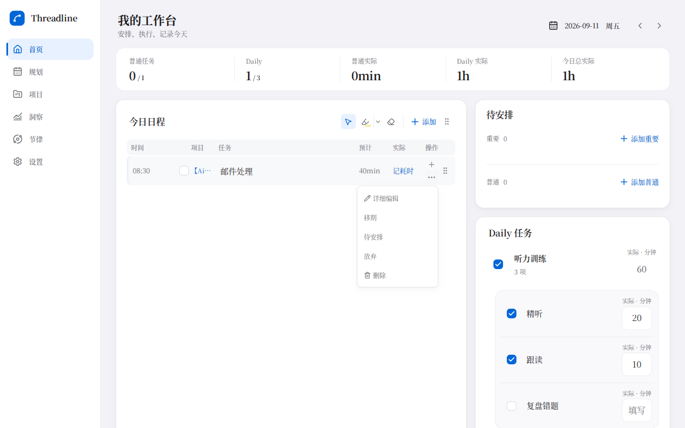
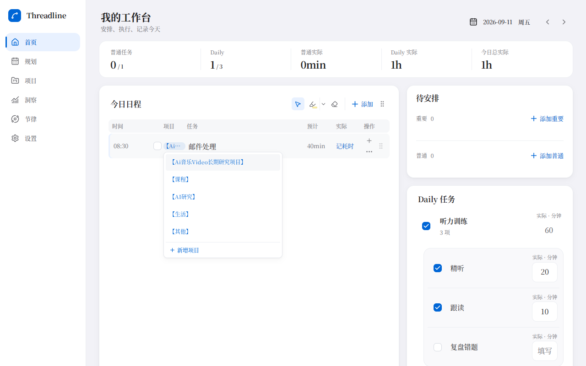

<!-- 文件用途：说明日程浮层、任务保存、工作站即时反馈与桌面装扮关闭的行为和验证边界。 -->

# 日程与工作站交互反馈

[返回交互参考](interaction-reference.md)

## 日程行与浮层

日程只有一行时，菜单也应完整展开。原来的绝对定位菜单放在横向滚动容器内，会增加内部滚动范围并被裁切；悬停和焦点还会通过 CSS 自动展开菜单，在出现滚动条时改变可用宽度。

更多菜单与项目选择改用挂载到 body 的原生 Popover，进入浏览器顶层；空间不足时向上展开，滚动和窗口缩放时重新定位。点击入口才打开，外部点击或 Escape 关闭。项目选择使用可聚焦的按钮，长名称在列宽内省略，完整名称保留在提示和无障碍名称中，不覆盖任务标题。

## 创建任务

保存期间保留当前草稿，显示保存状态并禁用表单；重复回车不会再发起请求，中文输入法选字的回车不会提交。保存失败保留原输入以便重试。成功时先关闭草稿再清空字段，避免显示空白新增行。

云端创建只等待项目前置条件和任务本体写入。任务确认后立即更新缓存、结束表单，历史写入和相关查询刷新继续在后台完成；这些操作仍计入已有的重启写入保护。历史收尾失败会明确提示“任务已创建，但记录同步失败”，不会误报创建失败并诱导重复提交。

## 工作站

清空、增删和排序先显示用户最新意图，再按顺序保存。保存期间后台旧查询不能覆盖这份待保存状态；后续操作以最新意图为基础排队。失败后读取服务端实际成员恢复界面并提示重试。

移除多个成员合并为一次软移除请求，清空不再逐条等待网络。只改变工作站引用，不删除原任务；继续通过现有 RLS 隔离用户。没有数据库迁移。

## 桌面装扮

装扮标题与关闭按钮保持在弹窗顶部，关闭按钮保留 44px 宽度。显示模态对话框或 Popover 时，暂停背景标题栏的原生拖动区域，关闭后自动恢复。依据 [Electron 自定义窗口交互文档](https://www.electronjs.org/docs/latest/tutorial/custom-window-interactions)，原生拖动区域会忽略鼠标事件；这与普通 DOM 的层级不同，不能只提高 z-index。

## 回归边界

- `tests/cloud-interaction-feedback.test.tsx`：可控慢请求、旧缓存、清空后立即添加、失败恢复和重试、任务成功后历史失败。
- `tests/task-create-feedback.test.tsx`：两类新增表单的保存锁定、防重复和输入法回车。
- `e2e/interaction-feedback.spec.ts`：单行列表的菜单可点击、项目切换并刷新保留、宋体长项目名不重叠、逐帧新增和两种皮卡主题反复关闭装扮；运行于桌面 Chrome、手机 Chrome 和 iPhone WebKit。
- `scripts/test-electron-interaction-feedback.mjs`：独立用户目录、1040×600 原生窗口，验证六次换装关闭和拖动区域恢复，纳入 `pnpm test:electron`。

浏览器和桌面回归使用隔离演示数据；云端延迟场景使用受控仓储。没有修改真实账号数据，真实网络往返和用户设备上的安装包仍需发布后验收。

## 界面截图

截图使用单条虚构任务和长项目名，保留宋体以匹配反馈中的排版条件。

