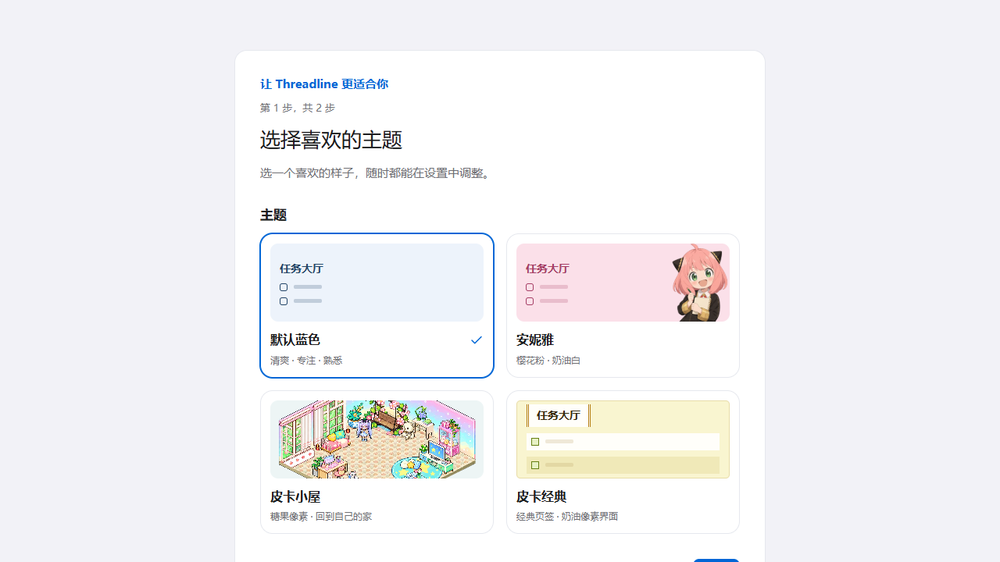
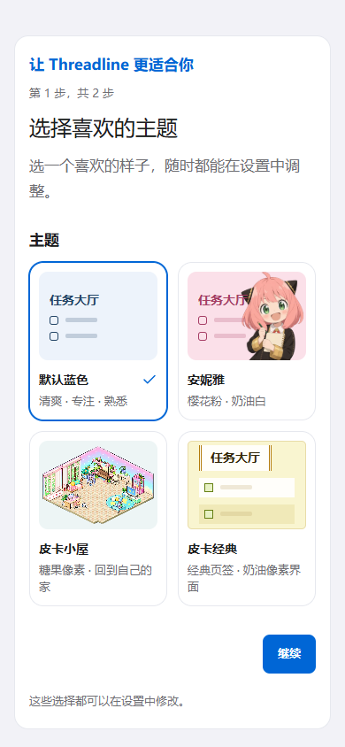

<!-- 文件用途：记录 0.1.8 的首次引导、个人设置、日程交互与发布顺序。 -->

# Threadline 0.1.8

- 首次登录后选择主题与性别，已有账号也补做一次；完成状态随账号同步，中断后可继续。主题即时预览，字体保留原选择。
- 男生隐藏节律入口，女生显示；可在设置的个人资料修改，历史节律记录保留。跨设备修改后当前页面同步调整。
- Windows 正式安装版新增开机自启动选择，可选“以后再选”，也可在设置中修改。每台电脑分别记录，网页与 iPhone PWA 不显示；开发版与目录预览包不会注册系统启动项。
- 首页改名为“任务大厅”，移除原有副标题。
- 今日日程填写有效起止时间后自动计算预计分钟；新增、行内编辑及详情编辑均支持，仍可手动调整预计值。

## 发布与验证

先应用增量迁移 `202609200001_account_preferences.sql`，再合并部署 Web/PWA，最后通过 `v0.1.8` tag 触发 Windows Release。迁移增加账号字段、受认证保护的偏好保存 RPC 和 Realtime 表，不删除已有业务记录，兼容旧客户端初始化。

本地 357 项单元测试、4 项相关桌面/手机 E2E、Lint、类型检查、SQL 静态检查、Web 构建及 Electron renderer/Main/Preload 构建已通过。四种主题的浅色/深色引导完成 axe 与窄屏检查；完整数据库和跨端回归由 PR CI 执行。正式 Windows 工作流验证 Preview/package-dir parity，再发布安装包、blockmap 与 latest.yml，上传后回下载校验。

自动化不替代真实 Windows 登录自启动、任务管理器禁用、安装升级与卸载，以及真机 iPhone PWA 验收。

## 界面

