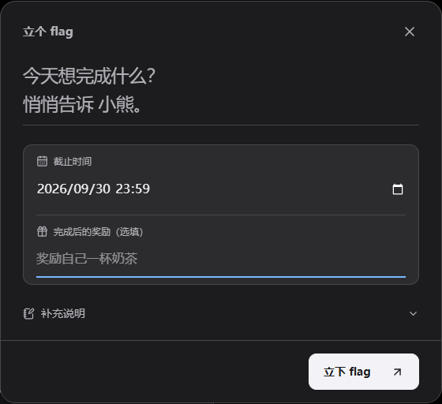
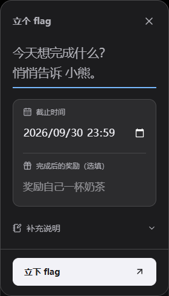
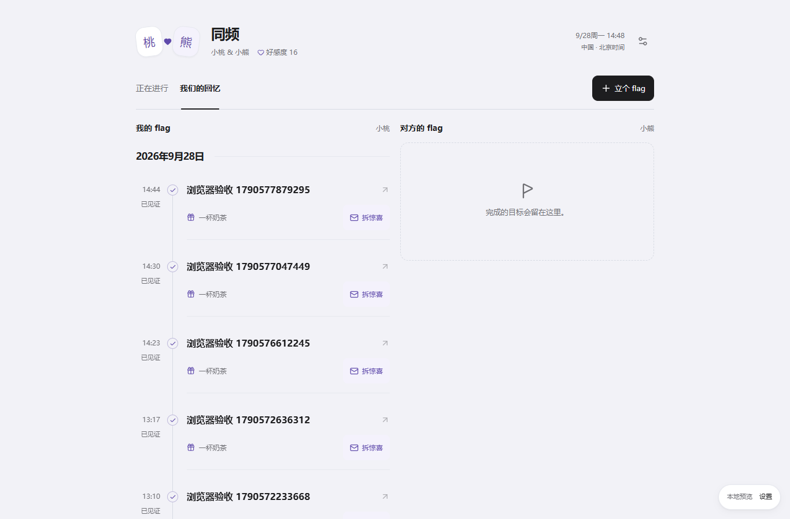
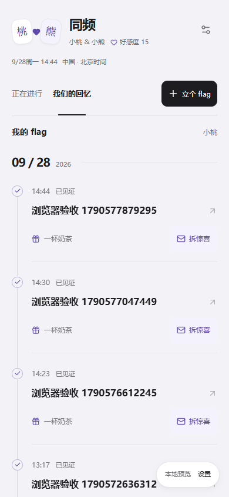
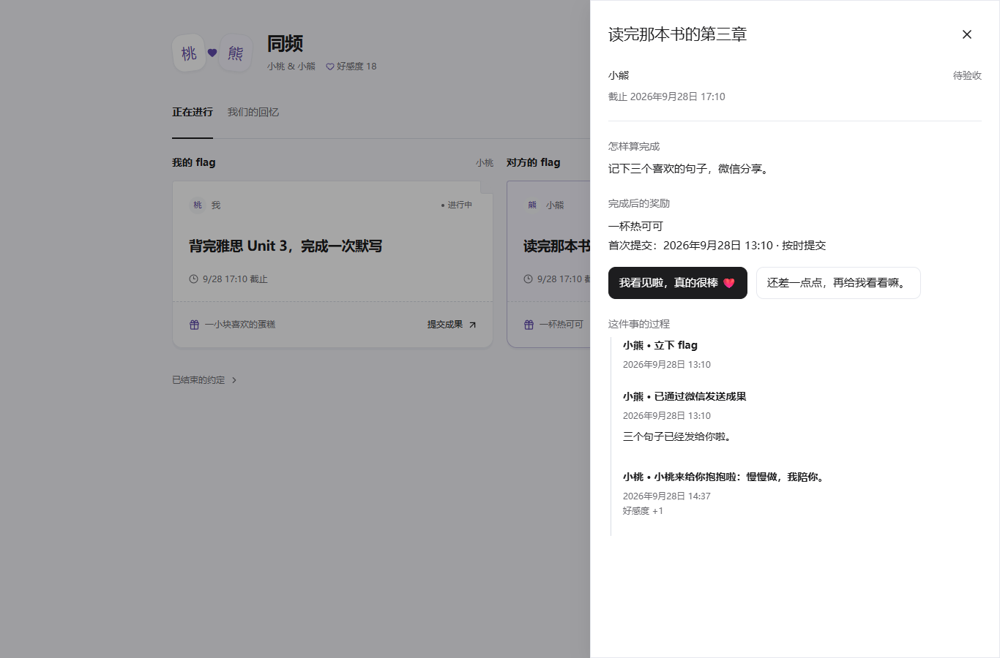
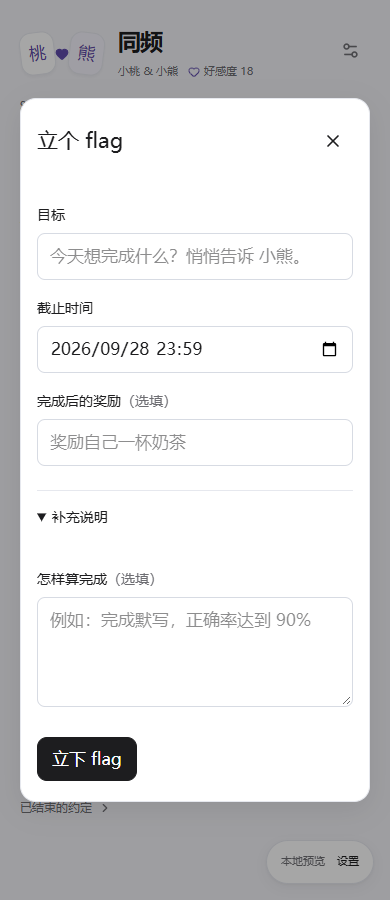
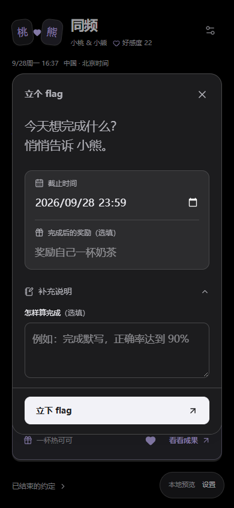

<!-- 文件用途：记录两人空间最终产品规则、数据库接口、权限和上线验证边界。 -->

# 两人空间

每个账号同时只绑定一个已有账号。关系为好朋友或情侣，双方确认后分别显示「我们的自习室」或「同频」。每条 flag 只有一个执行人，由绑定对象验收。Parallel 的独立日常互动不搬迁、不连接。

## 本次确认后的范围

2026-09-28，用户将原图片上传方案改为：**成果图片通过微信发送，执行人在 Threadline 勾选「已通过微信发送成果」，对方验收后才完成。** 应用不接入微信 API、不读取微信内容，不创建附件表或 Storage bucket。额外惊喜记录文字，照片仍通过微信发送。

主页只有正在进行与我们的回忆。进行中、回忆和已结束记录都按执行人分为「我的 flag」「对方的 flag」；桌面左右并排、手机上下排列，各栏独立分页。待我验收的目标置顶于对方栏。设置收纳称呼、关系变更、解除和旧空间。既有任务、习惯与投入统计不读取两人空间数据。

有待验收成果时，两个页签的列表上方均出现「待我验收 · 数量」和一条目标摘要，手机上位于自己的目标之前。点「去验收」直接打开详情，对方卡片也使用同名入口。没有待验收事项、旧空间或已解除关系时不显示此入口；读取失败可原位重试。

详情将最新一次微信成果声明、说明和查看者本地提交时间集中在「最新成果」区，验收通过 / 请补充按钮紧邻成果，过程记录默认折叠。图片仍需到微信查看，应用不读取微信，也不提供虚假的图片预览或发送状态检测。补充后始终展示最新声明，历次声明留在过程记录中。执行人只看到「等对方验收」和等待文案；验收方确认后看到明确的通过反馈，待办数量随服务端刷新减少，完成记录进入回忆。鼓励操作不与当前验收操作并列，双方目标归属继续分开。

2026-09-30 验收入口复验：7 项浏览器回归、类型检查、模块 lint 与文案同步通过。新增断言覆盖回忆页也能进入验收、手机入口在自己的目标之前、执行人没有自审按钮、要求补充后待办消失、再次提交展示新说明、通过后待办清除，以及 Escape 返回原入口。浏览器使用本地身份桥；本轮未改数据库，未执行远程推送、生产发布或真机验收。

## 2026-09-30 审阅问题修复

此前“本地 7 项通过”只描述当时本机运行。提交 32b6623 的 CI 36675416301 最终结果为 web、supabase、windows-electron 通过，preview-demo 在两人空间浏览器测试失败；不能用早先本机记录覆盖这次失败。

- 验收绑定 `current_submission_id`。详情只展示与此指针一致的成果；独立查询尚未对齐时提示正在核对，不提供通过或要求补充入口。两种验收请求均携带 `expected_submission_id` 和打开操作面板时的 version，RPC 持锁校验后提交状态、事件及计分。
- 编辑器属性轨道使用 `minmax(0, 1fr)`，子项及原生日期输入允许收缩；不使用横向裁切掩盖溢出。原焦点位置与滚动宽度断言保留，增加 390px、日期输入边界和 scrollLeft 检查。
- 首次离线预检查或确认读取失败，尚未发送 RPC，可修改后重新提交；数据库明确拒绝也释放请求。已发送且结果未知时仍保留原 ID，之后一次离线重试不会清掉早前的不确定状态。
- 截止时间接受 UTC 1900-01-01（含）至 10000-01-01（不含）的有限值，不要求在未来。创建、编辑 RPC 与表约束都校验；异常旧日期在列表及详情显示“时间数据异常”，编辑器留空并提示重新填写，不会导致页面渲染失败。
- 双方同日完成的回忆分别带“我的回忆 / 对方的回忆”名称，读屏可以区分，原 axe 检查继续执行。

追加迁移 `202609300001_together_review_safety.sql` 回填已有成果事件指针。日期约束使用 NOT VALID 保留已有异常值，新增和更新立即受约束；不猜测或自动改写原截止时间。已提交并锁定的异常旧记录需由维护者核对后修正，完成核对后可 VALIDATE CONSTRAINT。

本地验证：10 项浏览器回归通过，覆盖强制延迟成果查询、真实离线修改重试、读取异常日期及原有四主题/深浅色/键盘检查；68 项 SQL 检查通过，包含旧库升级和非法写入；全量单测及覆盖率门槛通过，最终数量见 PR。真实 Supabase 多会话由新提交 CI 执行，本机 Docker 未启动。未迁移正式数据库、未合并、未发布。

测试归属：`together.spec.ts` 和 `together-regressions.spec.ts` 均由 `playwright.together.config.ts` 启动本地 PostgreSQL 桥后执行，属于 CI 的 preview-demo 任务。通用 Web 配置不收集这两份文件，因为正式 Web 构建关闭预览路由且没有 3102 数据库桥；其余 Web 用例和所有专项断言保持不变。

## 页面构图与互动

页头把双人印记、空间名、称呼、好感度合在一起，右侧显示查看者本地时间与设置。删去常驻口号与重复说明；对方修改称呼时只提供可展开的轻提示。

目标卡片就是完整的操作单元：作者与状态在上，目标居中，短日期在下；底部虚线分隔文字奖励和当前操作。桌面两栏各自纵向排列，手机先我后对方；栏头仅保留「我的 flag / 对方的 flag」和昵称，长昵称截断展示，避免重新堆满说明。详情保留完整截止日期，时区放在时间悬停说明里，创建时间只在过程记录中显示。

两个略微相向的名字印记用心形或连接符连接，目标卡带小折角，奖励区像一张小票，回忆改为日期分组的纵向时间轴，完成节点保留见证时间和惊喜入口。对方的未完成目标可直接点心形加油，成功后显示反馈并禁用重复发送；服务端计分规则不变。悬停、页签和心形反馈尊重减少动态效果。

采用布局参考中的相关内容分组、渐进展示原则，以及可访问性参考中的明确焦点、44 像素触控目标与减少动态效果规则。重点是让目标先于说明进入视线，细节在操作时出现。

回忆时间轴参考 [Ant Design Timeline](https://ant.design/components/timeline/) 与 [Mantine Timeline](https://mantine.dev/core/timeline/) 的细线、节点和时间层级，由项目自身组件实现，不增加 UI 依赖。双方仍独立分栏、独立分页；加载更多后按查看者账号的本地日期统一归档，同一天只显示一次完整日期标题（如「2026年9月28日」）；每条记录的时刻放在线左侧，目标、奖励与惊喜在线右侧。目标和拆惊喜入口打开原详情，惊喜正文保持收起。

详情沿用主题字体与按钮：桌面右侧 560 像素抽屉，手机全宽；验收表单居中，Escape 只退出最上层并返回打开按钮。情侣名称「同频」仅使入口更含蓄，空间内的昵称、心形与互动仍保留。

创建表单采用 [GOV.UK 的选填标注方式](https://design-system.service.gov.uk/patterns/question-pages/)：奖励和完成标准的标题后同一行显示「（选填）」，不再另起一行小字。移除时区说明、微信提示与昵称说明等常驻辅助段落；详情顶部仅保留作者、状态和截止日期。解除绑定仍先展开再确认，按钮直接写明「解除并结束未完成的 flag」，移除冗长解释。

创建弹窗参考 [Linear 的任务创建流程](https://linear.app/docs/creating-issues)：目标用无外框的大字输入，截止与奖励合并为浅底属性区，补充说明用自定义折叠行展开；桌面主按钮靠右，手机主按钮整行呈现，滚动时底部操作区保持可见。专用样式只作用于目标编辑器，其他详情和设置弹窗保持不变；保留原生日期选择、账号时区、必填校验和错误时输入。新版编辑器另经 320 像素 × 四主题 × 深浅色检查，无横向溢出，axe 无违规。

### 编辑器焦点审计（2026-09-30）

原先的通用 `2px outline + 4px outline-offset` 直接作用于无边框字段：目标聚焦后出现抢眼的大框；奖励字段与标签间距为零，外描边进入标签区域。此前静态截图、axe 与业务闭环未覆盖这些交互状态，不能据此认定焦点设计正确。

参考 [Carbon Text input 的状态与间距规范](https://carbondesignsystem.com/components/text-input/style/) 和 [W3C Focus Visible](https://www.w3.org/WAI/WCAG21/Understanding/focus-visible)，按本项目的紧凑布局落实为：

- 目标保留浅色底线，目标、日期与奖励在聚焦时显示字段内部的 2px 主题色底线；标签与输入框间隔 6px，聚焦不改变尺寸。
- 完成标准已有完整边框，焦点描边向内绘制；按钮与折叠行继续保留可见焦点，系统高对比度模式回退到内部的系统色描边。
- 打开编辑器后，在原生模态可见时显式聚焦目标；关闭时仍返回打开按钮，避免 React 的提前聚焦被原生弹窗覆盖。

本轮 7 项浏览器回归、类型检查、模块 lint 与文案同步通过。截图与自动检查包含自动聚焦、点击、Tab/Enter 展开补充说明、深浅色、桌面与 320 像素、高对比度回退；另在 320 像素下复验四主题 × 深浅色，无横向溢出，编辑器 axe 无违规。焦点检查不等同于完整 WCAG 合规认证。业务与后端未改，本轮未重复生产构建或真机验收。





## 操作与时间规则

- 目标 1–100 字、补充说明最多 1,000 字、自定奖励最多 200 字。默认截止为创建者账号当日 23:59。
- 发布时间、首次提交、验收时间来自数据库。截止保存绝对时刻与创建时区。列表、详情和顶部实时钟均按查看者的账号时区显示。
- 夏令时缺失或重复的手填时间明确报错，用户选另一个明确时刻后提交，不默默猜测。
- 进行中 → 待验收 → 已完成；待验收可要求补充，补充后再次提交。首次提交前可编辑，之后锁定目标、标准、奖励与截止时间。每次声明与评价都保留。
- 按首次正式提交时间判断按时；晚验收或补充材料不更改首次提交。逾期仍可交成果。执行人可取消未完成 flag。
- 执行人只能提交，对方才能通过、要求补充、加油或送惊喜。额外惊喜仅限已完成 flag，一条一次，不影响验收结果。
- 情侣期间首次加油、首次通过、首次惊喜各 +1。事件唯一约束和事务保证重试不重复计分。好友期间不累计、不补算。
- 每人可给对方起昵称，双方可见；被称呼者可恢复展示名。关系变更需对方确认。解除单方确认即可，未完成 flag 结束，原空间仅原成员可读；新对象无法查看历史。

## 领域接口与安全

新增 `together_profiles / rooms / memberships / invites / flags / events / requests`。表对 authenticated 只有 SELECT 权限并启用 RLS；所有业务写入经过 `together_command(p_request_id, p_action, p_payload)`，邀请码预览走 `together_preview_invite(p_code)`。

操作包括 profile、invite、revoke_invite、accept_invite、settings、reset_nickname、propose_relationship、answer_relationship、end_room、create_flag、edit_flag、cancel_flag、submit、approve、changes、cheer、surprise。房间与 flag 的变更携带打开表单时的 version；提交附 `wechat_sent: true`。所有写入携带稳定 request_id。

唯一有效 membership 主键保证一人一绑定。绑定/解除使用事务锁，房间与 flag 行锁使互相冲突的验收与结束串行执行。完成、事件、好感度同事务提交。RPC 固定 search_path，内部函数撤销普通角色调用权。

请求日志按 actor + request_id 隔离；重复请求必须保持相同输入。客户端先查确认记录，网络未知结果保留原意图重试。冲突不会自动覆盖新状态。无离线自动补发；退出立即清理本领域缓存。

Realtime 只发布 rooms，空间新增和房间版本变化使当前领域缓存失效；空间由 ended_at 软结束，不发布含账号主键的 membership 删除。窗口恢复和联网主动回读。缺少迁移时显示功能未就绪，不阻塞个人工作台。

## 本地展示与验证

文案唯一清单：[together-copy.md](together-copy.md)。修改代码文案后运行 `node scripts/generate-together-copy.mjs`，`--check` 验证同步。

本地演示启动两个终端：

```powershell
node scripts/together/preview-server.mjs
```

```powershell
$env:THREADLINE_TOGETHER_PREVIEW='true'
$env:NEXT_PUBLIC_SUPABASE_URL='http://127.0.0.1:3102'
$env:NEXT_PUBLIC_SUPABASE_PUBLISHABLE_KEY='sb_publishable_local_together_preview'
$env:NEXT_PUBLIC_THREADLINE_TEST_ADAPTER='true'
node node_modules/next/dist/bin/next dev --hostname 127.0.0.1 --port 3100
```

打开 `http://localhost:3100/together-preview`。右下角「本地预览 → 设置」可切换北京/纽约测试身份、未绑定账号和主题，默认收起以免占据产品页面。预览桥运行原始 SQL 迁移与实际 PostgreSQL RLS/RPC，身份与数据是本地夹具；重启清空。预览不提供真实 Auth/Realtime（用轮询展示刷新）。仅显式启用的 development 路由可访问，生产 404，Electron 不包含这个 Web 路由。

验证命令：

```powershell
node scripts/test-together-database.mjs
node scripts/generate-together-copy.mjs --check
pnpm exec vitest run tests/together-time.test.ts
pnpm exec playwright test --config playwright.together.config.ts
# 本地 Supabase 启动并应用迁移后：
node scripts/test-together-integration.mjs
```

PGlite 验证 SQL、RLS 和事务业务规则，但单连接引擎不能替代 Supabase 多会话锁竞争、Auth 与 Realtime 验收。后者由独立本地集成脚本验证，Docker 未运行时明确记为未执行。

`pnpm test:together:e2e` 会自动启动本地预览所需的两个服务；本机已有预览时复用，CI 使用独立服务。`pnpm test:together:db`、`pnpm test:together:copy`、`pnpm test:together:integration` 分别覆盖 SQL 规则、文案同步与真实本地 Supabase 集成；已加入 CI。`package.json` 记录这些开发命令与 PGlite 测试依赖，`pnpm-lock.yaml` 为对应生成锁文件。`tsconfig.json` 的新增路径由 Next 自动维护，用于独立 `.next-together-preview` 输出中的路由类型。

## 2026-09-28 本地验收记录

| 检查                                   | 结果与边界                                                                                                                                                                                                                                   |
| -------------------------------------- | -------------------------------------------------------------------------------------------------------------------------------------------------------------------------------------------------------------------------------------------- |
| 类型检查、lint、SQL 静态约束、文案同步 | 通过；lint 排除独立预览的生成目录                                                                                                                                                                                                            |
| 全量单元测试与覆盖率                   | 85 文件、421 项通过；既有覆盖率门槛通过（统计范围由 vitest.config.ts 定义，不代表新增领域全量覆盖率）                                                                                                                                        |
| 原始迁移 / RLS / RPC                   | PGlite 的 34 项检查通过：第三方隔离、拒绝自审、幂等、补充记录、计分、结束与新对象隔离等                                                                                                                                                      |
| 浏览器实际界面                         | 6 项通过；覆盖桌面右侧抽屉、手机全屏、嵌套弹窗居中和 Escape 逐层返回；卡片一键加油且不重复计分；切换身份后归属分栏正确；四主题 × 深浅色 × 1366/390/320 宽度无横向溢出；默认主题主页 axe 无违规；另验长昵称、错误修正、Esc 焦点和减少动态效果 |
| 时区                                   | 北京 2026-10-01 22:00 的截止，纽约查看为 10:00；账号跨日默认截止、夏令时重复/缺失时间和首次提交判定有单测                                                                                                                                    |
| Web 生产构建                           | 通过，nonce CSP 校验通过；生产服务 `/together-preview` 实测 404                                                                                                                                                                              |
| Electron renderer 静态构建             | 通过，生成 CSP manifest 并通过构建边界校验，输出不含 Web 预览路由；未打包安装器                                                                                                                                                              |
| 真实 Supabase 多会话 / Auth / Realtime | 本机 Docker 未运行；原始实现提交 469f541 已通过 GitHub CI 的真实 Supabase 并发与 Realtime 集成，本轮未改后端                                                                                                                                 |
| 真机 iPhone 与正式环境                 | 未执行；未迁移生产数据库、未发布、未合并                                                                                                                                                                                                     |

浏览器闭环记录：小桃（北京）创建目标 → 勾选微信已发并提交说明 → 小熊（纽约）要求补充 → 小桃再次声明 → 小熊验收并留言 → 小熊发送文字惊喜 → 回忆出现完成记录。另用两个未绑定身份走完好友邀请、昵称设置与恢复、双方确认切换情侣、解除绑定。该浏览器身份由本地测试桥提供；真实 Auth / Realtime 已在 [原始实现 CI](https://github.com/Doris619619/Threadline/actions/runs/36381547256) 单独通过。

桌面与手机截图均使用本地测试身份，不含真实个人数据：












## 部署与兼容

先在测试 Supabase 按顺序应用 `202609280001_together.sql` 与 `202609300001_together_review_safety.sql`，验证权限/并发/Realtime，再迁移正式库和发布客户端。个人数据权限不修改；旧两人空间客户端缺少 expected_submission_id 时无法验收，需要更新客户端。无需 Storage、清理 Cron、微信凭据或新后端服务。

预览环境变量只用于本地展示，不能带到正式构建。合并前先向用户展示 localhost 并完成审阅；本次代码提交不代表授权生产迁移、合并或发布。真实 iPhone、真实多端账号及正式环境均单独验收。
