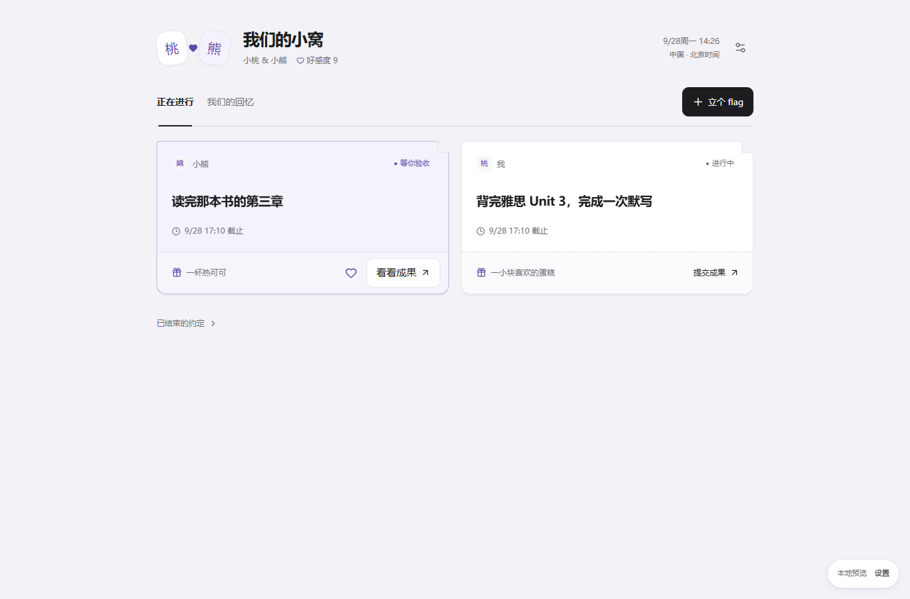
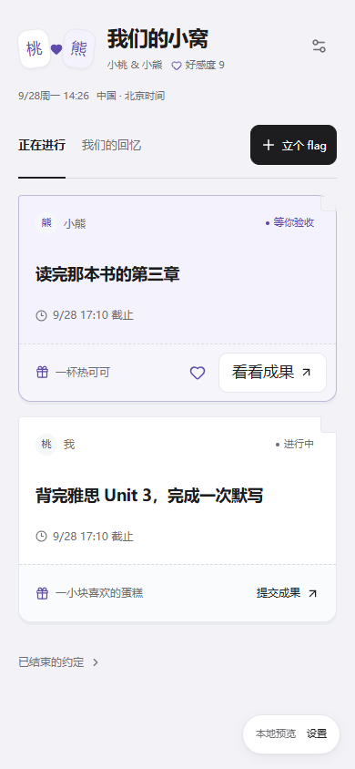

<!-- 文件用途：记录两人空间最终产品规则、数据库接口、权限和上线验证边界。 -->

# 两人空间

每个账号同时只绑定一个已有账号。关系为好朋友或情侣，双方确认后分别显示「我们的自习室」或「我们的小窝」。每条 flag 只有一个执行人，由绑定对象验收。Parallel 的独立日常互动不搬迁、不连接。

## 本次确认后的范围

2026-09-28，用户将原图片上传方案改为：**成果图片通过微信发送，执行人在 Threadline 勾选「已通过微信发送成果」，对方验收后才完成。** 应用不接入微信 API、不读取微信内容，不创建附件表或 Storage bucket。额外惊喜记录文字，照片仍通过微信发送。

主页只有正在进行与我们的回忆。待我验收、我的目标、对方的目标按此顺序进入同一个便笺网格，数据仍分别分页。设置收纳称呼、关系变更、解除和旧空间。既有任务、习惯与投入统计不读取两人空间数据。

## 页面构图与互动

页头把双人印记、空间名、称呼、好感度合在一起，右侧显示查看者本地时间与设置。删去常驻口号与重复说明；对方修改称呼时只提供可展开的轻提示。

目标卡片就是完整的操作单元：作者与状态在上，目标居中，短日期在下；底部虚线分隔文字奖励和当前操作。桌面两列、手机单列，不再给每个人另起一段大标题。完整日期与时区保留在详情与时间悬停说明里。

两个略微相向的名字印记用心形或连接符连接，目标卡带小折角，奖励区像一张小票，回忆卡保留见证印记和惊喜入口。对方的未完成目标可直接点心形加油，成功后显示反馈并禁用重复发送；服务端计分规则不变。悬停、页签和心形反馈尊重减少动态效果。

采用布局参考中的相关内容分组、渐进展示原则，以及可访问性参考中的明确焦点、44 像素触控目标与减少动态效果规则。重点是让目标先于说明进入视线，细节在操作时出现。

## 操作与时间规则

- 目标 1–100 字、补充说明最多 1,000 字、自定奖励最多 200 字。默认截止为创建者账号当日 23:59。
- 发布时间、首次提交、验收时间来自数据库。截止保存绝对时刻与创建时区。列表、详情和顶部实时钟均按查看者的账号时区显示。
- 夏令时缺失或重复的手填时间明确报错，用户选另一个明确时刻后提交，不默默猜测。
- 进行中 → 待验收 → 已完成；待验收可要求补充，补充后再次提交。首次提交前可编辑，之后锁定目标、标准、奖励与截止时间。每次声明与评价都保留。
- 按首次正式提交时间判断按时；晚验收或补充材料不更改首次提交。逾期仍可交成果。执行人可取消未完成 flag。
- 执行人只能提交，对方才能通过、要求补充、加油或送惊喜。额外惊喜仅限已完成 flag，一条一次，不影响验收结果。
- 情侣期间首次加油、首次通过、首次惊喜各 +1。事件唯一约束和事务保证重试不重复计分。好友期间不累计、不补算。
- 每人可给对方起昵称，双方可见；被称呼者可恢复展示名。关系变更需对方确认。解除单方确认即可，未完成 flag 结束，原空间仅原成员可读；新对象无法查看历史。

## 领域接口与安全

新增 `together_profiles / rooms / memberships / invites / flags / events / requests`。表对 authenticated 只有 SELECT 权限并启用 RLS；所有业务写入经过 `together_command(p_request_id, p_action, p_payload)`，邀请码预览走 `together_preview_invite(p_code)`。

操作包括 profile、invite、revoke_invite、accept_invite、settings、reset_nickname、propose_relationship、answer_relationship、end_room、create_flag、edit_flag、cancel_flag、submit、approve、changes、cheer、surprise。房间与 flag 的变更携带打开表单时的 version；提交附 `wechat_sent: true`。所有写入携带稳定 request_id。

唯一有效 membership 主键保证一人一绑定。绑定/解除使用事务锁，房间与 flag 行锁使互相冲突的验收与结束串行执行。完成、事件、好感度同事务提交。RPC 固定 search_path，内部函数撤销普通角色调用权。

请求日志按 actor + request_id 隔离；重复请求必须保持相同输入。客户端先查确认记录，网络未知结果保留原意图重试。冲突不会自动覆盖新状态。无离线自动补发；退出立即清理本领域缓存。

Realtime 只发布 rooms，空间新增和房间版本变化使当前领域缓存失效；空间由 ended_at 软结束，不发布含账号主键的 membership 删除。窗口恢复和联网主动回读。缺少迁移时显示功能未就绪，不阻塞个人工作台。

## 本地展示与验证

文案唯一清单：[together-copy.md](together-copy.md)。修改代码文案后运行 `node scripts/generate-together-copy.mjs`，`--check` 验证同步。

本地演示启动两个终端：

```powershell
node scripts/together/preview-server.mjs
```

```powershell
$env:THREADLINE_TOGETHER_PREVIEW='true'
$env:NEXT_PUBLIC_SUPABASE_URL='http://127.0.0.1:3102'
$env:NEXT_PUBLIC_SUPABASE_PUBLISHABLE_KEY='sb_publishable_local_together_preview'
$env:NEXT_PUBLIC_THREADLINE_TEST_ADAPTER='true'
node node_modules/next/dist/bin/next dev --hostname 127.0.0.1 --port 3100
```

打开 `http://localhost:3100/together-preview`。右下角「本地预览 → 设置」可切换北京/纽约测试身份、未绑定账号和主题，默认收起以免占据产品页面。预览桥运行原始 SQL 迁移与实际 PostgreSQL RLS/RPC，身份与数据是本地夹具；重启清空。预览不提供真实 Auth/Realtime（用轮询展示刷新）。仅显式启用的 development 路由可访问，生产 404，Electron 不包含这个 Web 路由。

验证命令：

```powershell
node scripts/test-together-database.mjs
node scripts/generate-together-copy.mjs --check
pnpm exec vitest run tests/together-time.test.ts
pnpm exec playwright test --config playwright.together.config.ts
# 本地 Supabase 启动并应用迁移后：
node scripts/test-together-integration.mjs
```

PGlite 验证 SQL、RLS 和事务业务规则，但单连接引擎不能替代 Supabase 多会话锁竞争、Auth 与 Realtime 验收。后者由独立本地集成脚本验证，Docker 未运行时明确记为未执行。

`pnpm test:together:e2e` 会自动启动本地预览所需的两个服务；本机已有预览时复用，CI 使用独立服务。`pnpm test:together:db`、`pnpm test:together:copy`、`pnpm test:together:integration` 分别覆盖 SQL 规则、文案同步与真实本地 Supabase 集成；已加入 CI。`package.json` 记录这些开发命令与 PGlite 测试依赖，`pnpm-lock.yaml` 为对应生成锁文件。`tsconfig.json` 的新增路径由 Next 自动维护，用于独立 `.next-together-preview` 输出中的路由类型。

## 2026-09-28 本地验收记录

| 检查                                   | 结果与边界                                                                                                                                                   |
| -------------------------------------- | ------------------------------------------------------------------------------------------------------------------------------------------------------------ |
| 类型检查、lint、SQL 静态约束、文案同步 | 通过；lint 排除独立预览的生成目录                                                                                                                            |
| 全量单元测试与覆盖率                   | 85 文件、421 项通过；既有覆盖率门槛通过（统计范围由 vitest.config.ts 定义，不代表新增领域全量覆盖率）                                                        |
| 原始迁移 / RLS / RPC                   | PGlite 的 34 项检查通过：第三方隔离、拒绝自审、幂等、补充记录、计分、结束与新对象隔离等                                                                      |
| 浏览器实际界面                         | 5 项通过；新增卡片一键加油且不重复计分；四主题 × 深浅色 × 1366/390/320 宽度无横向溢出；默认主题主页 axe 无违规；另验长昵称、错误修正、Esc 焦点和减少动态效果 |
| 时区                                   | 北京 2026-10-01 22:00 的截止，纽约查看为 10:00；账号跨日默认截止、夏令时重复/缺失时间和首次提交判定有单测                                                    |
| Web 生产构建                           | 通过，nonce CSP 校验通过；生产服务 `/together-preview` 实测 404                                                                                              |
| Electron renderer 静态构建             | 通过，生成 CSP manifest 并通过构建边界校验，输出不含 Web 预览路由；未打包安装器                                                                              |
| 真实 Supabase 多会话 / Auth / Realtime | 本机 Docker 未运行；原始实现提交 469f541 已通过 GitHub CI 的真实 Supabase 并发与 Realtime 集成，本轮未改后端                                                 |
| 真机 iPhone 与正式环境                 | 未执行；未迁移生产数据库、未发布、未合并                                                                                                                     |

浏览器闭环记录：小桃（北京）创建目标 → 勾选微信已发并提交说明 → 小熊（纽约）要求补充 → 小桃再次声明 → 小熊验收并留言 → 小熊发送文字惊喜 → 回忆出现完成记录。另用两个未绑定身份走完好友邀请、昵称设置与恢复、双方确认切换情侣、解除绑定。该浏览器身份由本地测试桥提供；真实 Auth / Realtime 已在 [原始实现 CI](https://github.com/Doris619619/Threadline/actions/runs/36381547256) 单独通过。

桌面与手机截图均使用本地测试身份，不含真实个人数据：





## 部署与兼容

先在测试 Supabase 应用 `202609280001_together.sql`，验证权限/并发/Realtime，再迁移正式库和发布客户端。现有表与个人数据权限不修改，旧客户端继续工作。无需 Storage、清理 Cron、微信凭据或新后端服务。

预览环境变量只用于本地展示，不能带到正式构建。合并前先向用户展示 localhost 并完成审阅；本次代码提交不代表授权生产迁移、合并或发布。真实 iPhone、真实多端账号及正式环境均单独验收。
